# aw10-final

基于 Spring-Webflux 技术实现了响应式购物系统。系统使用了 aw08 中的架构，包括网关，商品服务，购物车服务，订单服务，结算服务和配送服务。

## Discovery Service
使用 netflix-eureka-server 构建发现服务，各服务之间通过 WebClient 进行通信，并进行了负载均衡，因此很容易对系统进行扩展，只需要多开几个达到瓶颈的微服务实例即可  

## GateWay Service
使用 spring-cloud-gateway 作为网关 

## Product Service
使用 spring-boot-starter-batch 处理 Amazon 商品数据，构建初始数据库，得到三万多商品  
使用 spring-boot-starter-data-mongodb-reactive 进行数据访问和持久化存储  
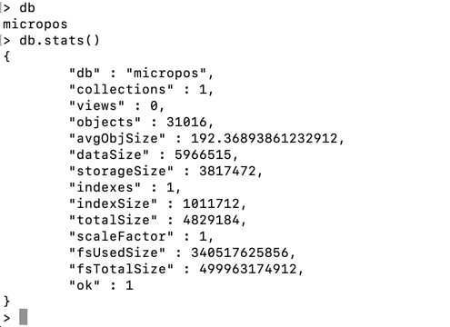  
使用 spring-boot-starter-webflux 实现 RESTful API 控制器，提供如下 API  
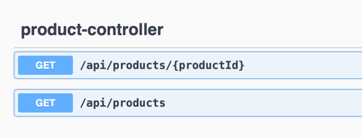  

## Cart Service
使用 WebClient 与 Product Service 通信，获取商店的商品信息  
使用 spring-boot-starter-webflux 实现 RESTful API 控制器，提供如下 API  
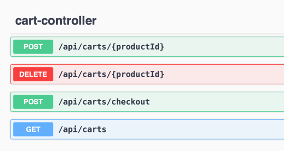  
可以向购物车中添加一件商品，删除一件商品，获取当前购物车的信息，或接受 Order Service 的请求进行结算

## Counter Service
使用 spring-boot-starter-webflux 实现 RESTful API 控制器，提供如下 API  
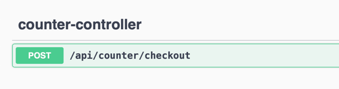  
接受来自 Cart Service 的阶段请求，计算当前购物车的总价格

## Order Service
使用 spring-boot-starter-webflux 实现 RESTful API 控制器，提供如下 API  
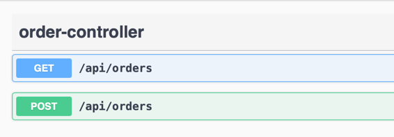  
GET 请求获取所有订单，POST 请求基于当前的购物车创建订单，当前创建完成后通过 SteamBridge 发送创建物流的消息，使用 spring-cloud-starter-stream-rabbit 作为消息队列  
使用 spring-boot-starter-data-mongodb-reactive 进行数据持久化存储

## Delivery Service
使用 spring-boot-starter-webflux 实现 RESTful API 控制器，提供如下 API  
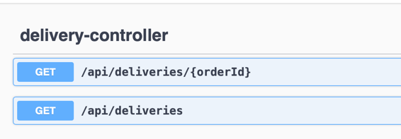  
可以根据 orderId 查询与之对应的订单或者查询所有订单  
消费来此 Order Service 的消息创建订单  
使用 spring-boot-starter-data-mongodb-reactive 进行数据访问和持久化存储

系统启动后，各微服务注册至发现服务
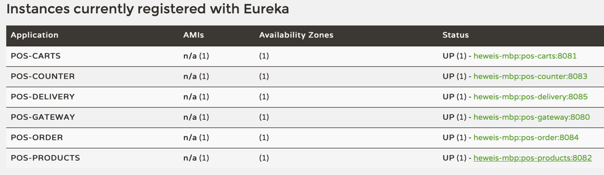

列举50个商品
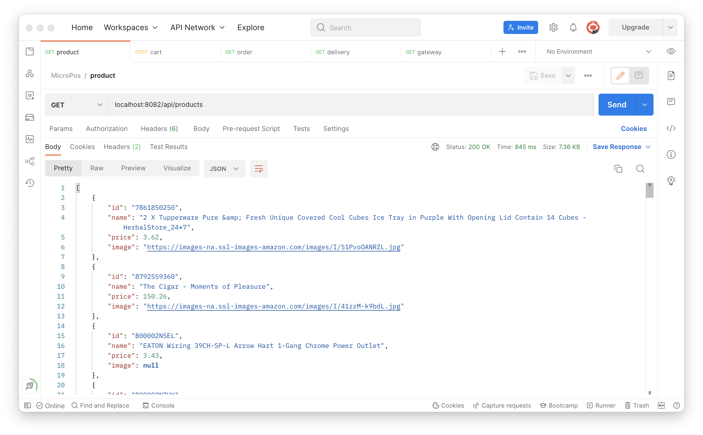

通过商品 ID 加入购物车
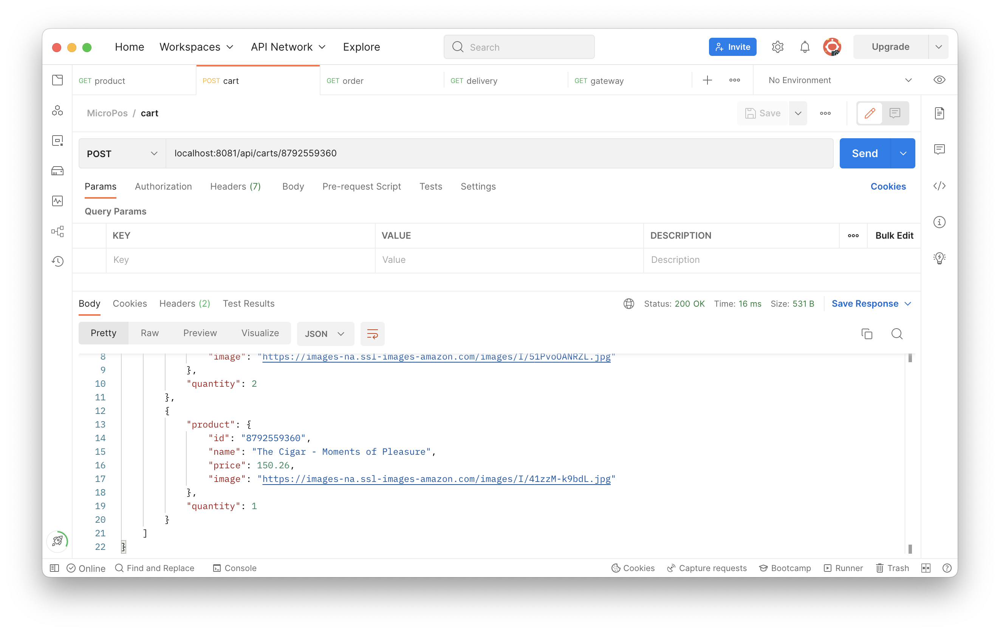

基于当前购物车创建订单
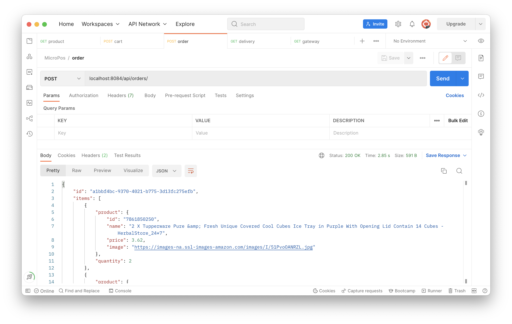

根据订单 ID 查询物流信息
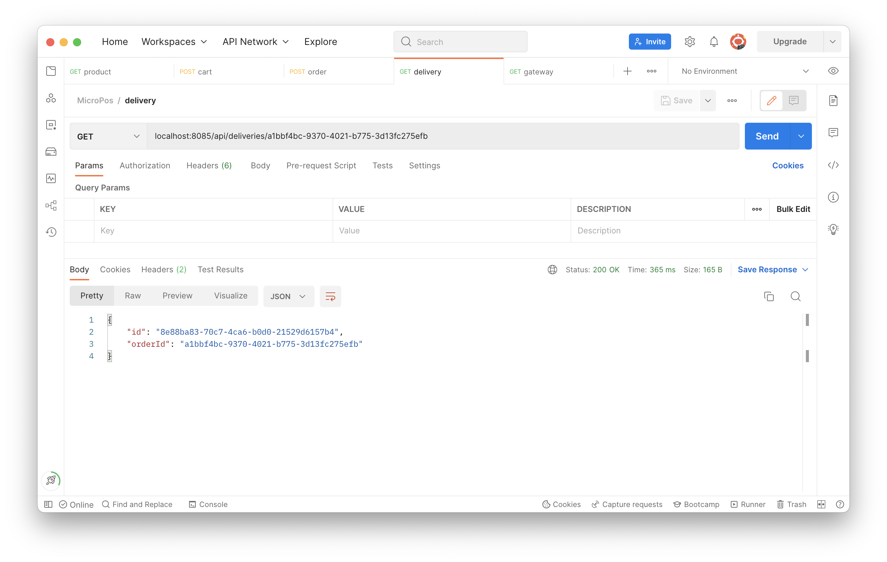

Please develop a **fully functional** online purchase order system.

- It should have a superb collection of goods merchandises
- Customer can browse/search for merchandises, add selected one into his shopping cart and checkout to complete a transaction.
- User can get delivery status updates continuously.

The system should be of a **reactive architecture**, which means it should be 

-  Responsive: it should response to the user request timely.
-  Resilient: it should not be easily broken down.
-  Elastic: it should be flexible to scale out.
-  Message Driven: it should has loosely coupled components that communicates with each other asynchronously.

Please design tests/experiements to demostrate that your system fulfills such requirements as stated in [The Reactive Manifesto](https://www.reactivemanifesto.org)

**Submit your codes/documents/tests/experiements of your system.**
